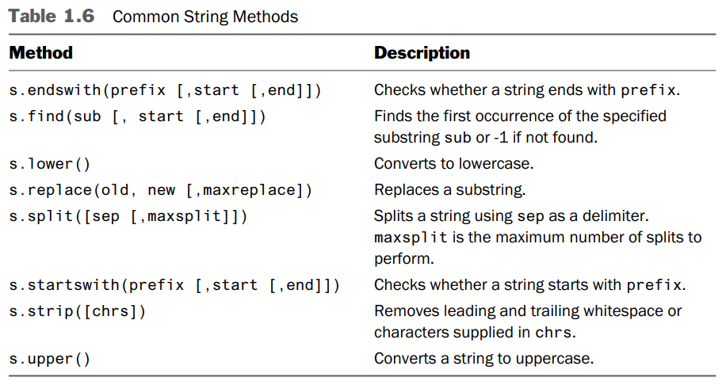

# 1 Python Basics

## 1.1 Running Python

- Programs are executed by an **interpreter**.
- To pick a version, if both Python 2 and Python 3 are installed:
  ```bash
  # In bash
  # Start version 2
  python2

  # Start version 3
  python3
  ```
- In **interactive mode**, variable `_` holds the result of the last operation.

## 1.2 Python Programs

- Common to use `#!` to specify the interpreter:
  ```py
  #!/usr/bin/env python3
  print('Hello World')
  ```

## 1.3 Primitives, Variables, and Expressions

- Basics:
  ``` py
  # Primitive types
  # ---------------
  42          # int
  4.2         # float
  'forty-two' # str
  True        # bool

  # Variable
  # --------
  x = 42
  # The type is merely a hint, it does not prevent you from assigning a different kind of value.
  x: int = 42

  # f-string
  # --------
  # Each substitution {} can have an optional formatting specifier.
  # More formatting codes in Chapter 9.
  print(f'{year:>3d} {principal:0.2f}')

  # Falsy values
  # ------------
  False
  None  # null
  0
  ''    # empty
  ```
- Common to use **four spaces** per indentation level.

## 1.4 Arithmetic Operators

- Noteworthy operators:
  Operation | Description
  ----------|------------
  `x / y` | Produce a float when applied to int.<br />E.g. `4 / 2` -> `2.0`
  `x // y` | Truncating division.<br />E.g. `5 // 2` -> `2`
  `x ** y` | Power
- Common Mathematic Functions:
  Function | Description
  ---------|------------
  `abs(x)` | Positive value
  `divmod(x, y)` | Return `(x // y, x % y)` (A tuple)
  `pow(x, y [, modulo])` | Return `(x ** y) % modulo`
  `round(x, [n])` | Implement "**banker's rounding**".
- Logical Operators:
  Operator |
  ----------
  `x or y` |
  `x and y` |
  `not x` |
- Python does not have `++` or `--` operators.

## 1.5 Conditionals and Control Flow

- Use `pass` to create an **empty clause** (python doesn't use {} to define scope).
  ```py
  if a < b:
      pass # Do nothing
  else:
      print('Computer says No')
  ```
- Conditional expression:
  ```py
  max_val = a if a > b else b
  ```
- Assignment expression (walrus operator `:=`):
  ```py
  # Use := to combine the assignment of a variable and a conditional.
  x = 0
  while (x := x + 1) < 10: # Print 1, 2, 3, ..., 9
      print(x)
  ```

## 1.6 Text Strings

- String literal:
  ```py
  a = 'Single/double-quoted strings must be specified on one line.'

  b = '''Triple-quoted strings 
  can be specified on 
  multiple lines.'''

  # Immediately adjacent string literals are concatenated into a single string.
  print(
  'Content-type: text/html\n'
  '\n'
  '<h1> Hello World </h1>\n'
  'Click <a href="http://www.python.org">here</a>.\n'
  )
  ```
- Use `format()` method and `%` operator as alternatives to f-strings.
  ```py
  print(f'{year:>3d} {principal:0.2f}')

  print('{0:>3d} {1:0.2f}'.format(year, principal))
  print('%3d %0.2f' % (year, principal))
  ```
- **Negative indices** index from the end of the string.
  ```py
  a = 'Hello World'
  c = a[-1]    # c = 'd'
  ```
- Use slicing operator `s[i:j]` to extract a substring.
  ```py
  a = 'Hello World'
  c = a[:5]    # c = 'Hello'
  d = a[6:]    # d = 'World'
  e = a[3:8]   # e = 'lo Wo'
  f = a[-5:]   # f = 'World'
  ```
- Common String Methods:
  
- Convert string to int or float:
  ```py
  x = '37'
  y = '42.79'
  z = int(x) + float(y) # z = 79.78999999999999 (float arithmetic issue)
  ```
- Convert non-string to string:
  ```py
  s = "hello\nworld"

  # Print:
  #   hello
  #   world
  print(str(s))
  # Print:
  #   'hello\nworld'
  print(repr(s))

  print(format(12.34567, "0.2f"))
  print(f'{12.34567:0.2f}')
  ```
- Use `repr(s)` when **debugging** because it shows you more information.
