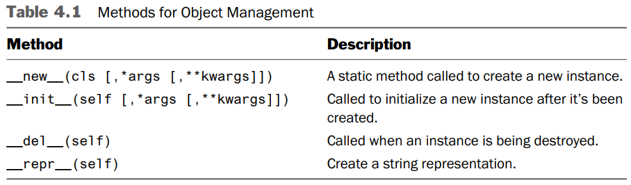
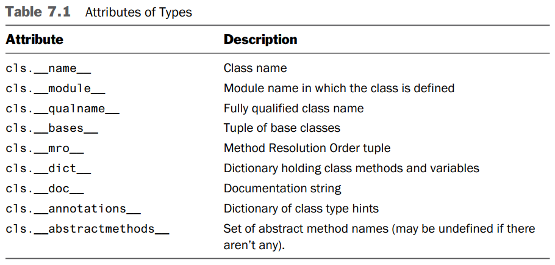

# 1 Python Basics

## 1.1 Running Python

- Programs are executed by an **interpreter**.
- To pick a version, if both Python 2 and Python 3 are installed:
  ```bash
  # In bash
  # Start version 2
  python2

  # Start version 3
  python3
  ```
- In **interactive mode**, variable `_` holds the result of the last operation.

## 1.2 Python Programs

- Common to use `#!` to specify the interpreter:
  ```py
  #!/usr/bin/env python3
  print('Hello World')
  ```

## 1.3 Primitives, Variables, and Expressions

- Basics:
  ```py
  # Primitive types
  # ---------------
  42          # int
  4.2         # float
  'forty-two' # str
  True        # bool

  # Variable
  # --------
  x = 42
  # The type is merely a hint, it does not prevent you from assigning a different kind of value.
  x: int = 42

  # f-string
  # --------
  # Each substitution {} can have an optional formatting specifier.
  # More formatting codes in Chapter 9.
  print(f'{year:>3d} {principal:0.2f}')

  # Falsy values
  # ------------
  False
  None  # null
  0
  ''    # empty
  ```
- Common to use **four spaces** per indentation level.

## 1.4 Arithmetic Operators

- Noteworthy operators:
  Operation | Description
  ----------|------------
  `x / y` | Produce a float when applied to int.<br />E.g. `4 / 2` -> `2.0`
  `x // y` | Truncating division.<br />E.g. `5 // 2` -> `2`
  `x ** y` | Power
- Common Mathematic Functions:
  Function | Description
  ---------|------------
  `abs(x)` | Positive value
  `divmod(x, y)` | Return `(x // y, x % y)` (A tuple)
  `pow(x, y [, modulo])` | Return `(x ** y) % modulo`
  `round(x, [n])` | Implement "**banker's rounding**".
- **Logical Operators:** `x or y`, `x and y`, `not x`
- Python does not have `++` or `--` operators.

## 1.5 Conditionals and Control Flow

- Use `pass` to create an **empty clause** (python doesn't use {} to define scope).
  ```py
  if a < b:
      pass # Do nothing
  else:
      print('Computer says No')
  ```
- Conditional expression:
  ```py
  max_val = a if a > b else b
  ```
- Assignment expression (walrus operator `:=`):
  ```py
  # Use := to assign to a variable and return its value.
  # Example: Combine the assignment of a variable and a conditional.
  x = 0
  while (x := x + 1) < 10: # Print 1, 2, 3, ..., 9
      print(x)
  ```

## 1.6 Text Strings

- String literal:
  ```py
  a = 'Single/double-quoted strings must be specified on one line.'

  b = '''Triple-quoted strings
  can be specified on
  multiple lines.'''

  # Immediately adjacent string literals are concatenated into a single string.
  print(
  'Content-type: text/html\n'
  '\n'
  '<h1> Hello World </h1>\n'
  'Click <a href="http://www.python.org">here</a>.\n'
  )
  ```
- **Alternatives to f-strings** - `format()` method and `%` operator:
  ```py
  print(f'{year:>3d} {principal:0.2f}')

  print('{0:>3d} {1:0.2f}'.format(year, principal))
  print('%3d %0.2f' % (year, principal))
  ```
- **Negative indices** index from the end of the string.
  ```py
  a = 'Hello World'
  c = a[-1]    # c = 'd'
  ```
- Use slicing operator `s[i:j]` to extract a **substring**.
  ```py
  a = 'Hello World'
  c = a[:5]    # c = 'Hello'
  d = a[6:]    # d = 'World'
  e = a[3:8]   # e = 'lo Wo'
  f = a[-5:]   # f = 'World'
  ```
- Common String Methods:
  
- Convert string **to int or float**:
  ```py
  x = '37'
  y = '42.79'
  z = int(x) + float(y) # z = 79.78999999999999 (float arithmetic issue)
  ```
- Convert non-string **to string**:
  ```py
  s = "hello\nworld"

  # Print:
  #   hello
  #   world
  print(str(s))
  # Print:
  #   'hello\nworld'
  print(repr(s))

  print(format(12.34567, "0.2f"))
  print(f'{12.34567:0.2f}')
  ```
- When **debugging**, use `repr(s)` because it shows you more information.

## 1.7 File Input and Output

- `with` statement:
  ```py
  # Once control leaves the with statement block, the file is automatically closed.
  with open("data.txt") as file:
      for line in file:
          print(line, end='')
  ```
- Common file operations:
  ```py
  # To read the entire file as a string.
  with open('data.txt') as file:
      data = file.read() # <--

  # To read in chunks (e.g. 10,000 bytes per chunk)
  with open('data.txt') as file:
      while (chunk := file.read(10000)): # <--
          print(chunk, end='')

  # Print/write to file.
  with open('out.txt', 'wt') as out:
      while year <= num_years:
          principal = principal * (1 + rate)
          print(f'{year:>3d} {principal:0.2f}', file=out) # <--
          out.write(f'{year:3d} {principal:0.2f}\n') # <--
          year += 1
  ```

## 1.8 Lists

- Can contain mix of objects:
  ```py
  mix_objects = [1, "Dave", 3.14, ["Mark", 7, 9, [100, 101]], 10]
  ```
- Common list operations:
  ```py
  names = ["Dave", "Paula", "Thomas", "Lewis"]
  # Replace the first two items with ["Dave", "Mark", "Jeff"]
  names[0:2] = ["Dave", "Mark", "Jeff"]

  # List comprehension (preferred)
  values = [int(row[1]) * float(row[2]) for row in rows]

  # Without list comprehension
  values = []
  for row in rows:
      values.append(int(row[1]) * float(row[2]))
  total = sum(values)
  ```

## 1.9 Tuples

- Pack a collection of values into an **immutable object**.
- Support most of the same operations as lists.
- Best viewed as a single immutable object that consists of several parts, not as a collection of distinct objects like a list.
- The variable `_` can be used to indicate a discarded value:
  ```py
  total = sum([shares * price for _, shares, price in portfolio])
  ```

## 1.10 Sets

- Elements are **restricted to immutable objects**. E.g. you can't make a set containing lists.
- **Unordered** (the order of items can't be predicted) and cannot be indexed by numbers.
- Set comprehension:
  ```py
  names = {s[0] for s in portfolio}
  ```
- Set operations:
  ```py
  t = {"IBM", "MSFT", "HPE", "IBM", "CAT"}
  s = {"IBM", "MSFT", "AA"}

  a = t | s  # Union {'MSFT', 'CAT', 'HPE', 'AA', 'IBM'}
  b = t & s  # Intersection {'IBM', 'MSFT'}
  c = t - s  # Difference { 'CAT', 'HPE' }
  d = s - t  # Difference { 'AA' }
  e = t ^ s  # XOR { 'CAT', 'HPE', 'AA' }

  s.update({"JJ", "GE", "ACME"})  # Adds multiple items

  t.remove("IBM")    # Raise KeyError if absent
  t.discard("SCOX")  # Remove if exists
  ```

## 1.11 Dictionaries

- Dictionary operations:
  ```py
  # Use case 1: Used as a mapping for performing fast lookups.
  prices = {
      "GOOG": 490.1,
      "AAPL": 123.5,
      "IBM": 91.5,
      "MSFT": 52.13,
  }

  # Use case 2: To define an object that consists of named fields.
  stock = {
      "name": "GOOG",
      "shares": 100,
      "price": 490.10
  }

  # To test the presence of a key.
  if "IBM" in prices:
      ...

  # To remove an element.
  del prices["GOOG"]

  # Use tuple to construct composite key.
  prices = {} # Alternative: prices = dict()
  prices["IBM", "2015-02-04"] = 91.42

  # Dictionary comprehension
  total_shares = {s[0]: 0 for s in portfolio}

  # To create from key-value values.
  pairs = [("IBM", 125), ("ACME", 50), ("PHP", 40)]
  d = dict(pairs)

  # To get a list of keys/values/items (actively reflects changes).
  price_keys = prices.keys()
  price_values = prices.values()
  price_items = prices.items() # List of tuples
  ```
- **Mutable data structures** such as lists, sets and dictionaries **can't be used as keys**.
- In Python 3.6 or later, the dictionary preserves the input order.

## 1.12 Iteration and Looping

- Example:
  ```py
  # To loop over a range of integers.
  for n in range(1, 10):  # stop = 10 (exclusive)
      print(f"2 to the {n} power is {2**n}")

  # Descending sequence
  for i in range(8, 1, -1):  # step = -1
      print(i)

  # To loop over a dictionary.
  prices = {"GOOG": 490.10, "IBM": 91.50, "AAPL": 123.15}
  for key in prices:
      print(key, "=", prices[key])
  ```
- `range()` object computes the values it represents **on demand** when lookups are requested.

## 1.13 Functions

- To include a **documentation string** as the first statement.
  ```py
  # Annotated with types.
  def compute_remainder(dividend: int, divisor: int) -> int:
      """
      Computes the remainder.
      """
      quotient = dividend // divisor
      result = dividend - quotient * divisor
      return result
  ```
- Annotations are **merely informational** and are not enforced at runtime.
- Parameter default value:
  ```py
  def connect(hostname, port, timeout=300):
      print(f"{hostname}:{port}")

  # Recommended to specify optional arguments using keyword arguments.
  connect("www.python.org", 80, timeout=500)
  ```
- When variables are defined inside a function, their **scope is local** (more details in **Chapter 5**).

## 1.14 Exceptions

- Catch and handle exceptions using `try` and `except` statement:
  ```py
  try:
      price = float(price_str)
  except ValueError as err:
      print("Reason:", err)
  ```
- To throw an exception:
  ```py
  raise RuntimeError("Computer says no")
  ```

## 1.15 Program Termination

- Example:
  ```py
  import atexit


  def cleanup():
      print("Cleaning up...")
      print("Program terminated.")


  atexit.register(cleanup)

  print("Program started.")

  raise SystemExit("Exit on error.")

  # Output:
  #   Program started.
  #   Exit on error.
  #   Cleaning up...
  #   Program terminated.
  ```

## 1.16 Objects and Classes

- **All values** are objects.
- `dir()` lists the methods available on an object. Useful in the interactive mode.
- `__<method>__()` - A special method that implements a operator. E.g. `__add__()` implement the `+` operator.
- In the **class**, the **first argument** in each method always refers to the object itself (`self`).
- **Internal attributes** are prefixed with underscore. E.g. `self._name`.
- Python does not have any mechanism for hiding or protecting data.
- A good idea to define `__repr__()` to facilitate **debugging**.
- **Inheritance** example:
  ```py
  class NumericStack(Stack):
      # New method
      def swap(self):
          a = self.pop()
          b = self.pop()
          self.push(a)
          self.push(b)

      # To change the behavior of an existing method.
      def push(self, item):
          if not isinstance(item, (int, float)):
              raise TypeError("Expected an int or float")
          super().push(item)  # <-
  ```
- Often, inheritance is not the best solution.
- **Composition** example:
  ```py
  class Calculator:
      def __init__(self):
          self._stack = Stack()  # <--

      def push(self, item):
          self._stack.push(item)

      def pop(self):
          return self._stack.pop()

      def add(self):
          self.push(self.pop() + self.pop())
  ```

## 1.17 Modules

- The module name is the same as the **file name**.
- `import` statement creates a new **namespace**.
- If the import statement fails (`ImportError`), check a few things:
  - Make sure the target `.py` file exists.
  - Check the directories in `sys.path`.
- `dir()` lists the contents of a module. Useful in the interactive mode.
- Package manager - https://pypi.org
- Example:
  ```py
  # To import a module.
  import readport

  # To import a module under a different name.
  import readport as rp

  # To import specific definitions.
  from readport import read_portfolio
  ```

## 1.18 Script Writing

- Any file can execute either as a **script** or as a **module**.
- Example:
  ```py
  # File: readport.py

  # If this file is run as the main script,
  #   the __name__ variable is set to "__main__".
  # else,
  #   the __name__ variable is set to "readport".
  if __name__ == "__main__":
      import sys

      main(sys.argv)
  ```

## 1.19 Packages

- A package is a **collection of modules**.
- `__init__.py` is used to mark a directory as a package.
- To import a module within the same package:
  ```py
  # pcost.py

  # Consider the following directory structure:
  #   tutorial/
  #     __init__.py
  #     readport.py
  #     pcost.py

  # Fully qualified import
  from tutorial import readport

  # Package-relative import
  from . import readport
  ```

## 1.20 Structuring an Application

- The **primary purpose** of the package is to manage `import` statements and the namespaces of modules.
- Example:
  ```
  tutorial-project/
      tutorial/
          __init__.py
          readport.py
          pcost.py
          stack.py
          ...
      tests/
          test_stack.py
          test_pcost.py
          ...
      examples/
          sample.py
          ...
      doc/
          tutorial.txt
          ...
  ```

## 1.21 Managing Third-Party Packages

- To install a package:
  ```bash
  pip install <package>
  ```
- Installed packages are stored in the `site-packages` directory.
- Inspect the `__file__` attribute of a package to find the path.
- Use a **virtual environment** to install packages for a specific project:
  ```
  python -m venv <venv_name>

  # To activate on Windows.
  <venv_name>\Scripts\activate
  ```

# 2 Operators, Expressions, and Data Manipulation

## 2.1 Literals

- Example:

  ```py
  # Integer
  x = 42  # Decimal integer
  bin(x)  # -> "0b101010"
  oct(x)  # -> "0o52"
  hex(x)  # -> "0x2a"

  # Float (IEEE 754 double-precision (64-bit))
  4.2
  42.
  .42
  4.2e+2
  ```

## 2.3 Standard Operators

- Example:

  ```py
  [1, 2, 3] + [4, 5]  # -> [1, 2, 3, 4, 5]
  [1, 2, 3] * 3       # -> [1, 2, 3, 1, 2, 3, 1, 2, 3]
  "%s has %d messages" % ("Dave", 37)

  # Mixed data types
  from factions import Fraction
  a = Fraction(2, 3)
  b = 5
  a + b  # -> Fraction(17, 3)
  ```

## 2.4 In-Place Assignment

- Example:

  ```py
  a = 3
  a += 1

  a = [1, 2, 3]
  a += [4, 5]  # In-place update.
  ```

## 2.5 Object Comparison

- An equality comparison between objects of incompatible types does not trigger an error but returns `False`.
- Example:
  ```py
  file == 2.0  # -> False
  2 == 2.0     # -> True

  a = [1, 2, 3]
  b = [1, 2, 3]
  # Identity operator
  a is b  # -> False
  # Equality operator
  a == b  # -> True
  ```
- Comparing objects with the `is` operator is almost never what you want, use `==` operator instead.

## 2.6 Ordered Comparison Operators - `<`, `<=`, `>`, `>=`

- For **sets**, `x < y` tests if `x` is **strict subset** of `y`.
- For **subsequences**, `x < y` tests if `x` is a **subsequence** of `y`.
- Dictionary does not support the ordered comparison operators.

## 2.9 Operations Involving Iterables


- For **strings**, `in` operator checks if the substring is contained in the string.
- `in` operator does not support wildcards or pattern matching.
- If the **\*-expansion** is used on one-time iteration objects (e.g. files), the subsequent iteration yields no result.

## 2.10 Operations on Sequences


- `s * n` creates shallow copies (**reference**) of the list.
- `s[-1]` returns the **last element**.
- Slicing example:
  ```py
  a = [0, 1, 2, 3, 4, 5, 6, 7, 8, 9]

  a[2:5]      # [2, 3, 4]
  a[:3]       # [0, 1, 2]
  a[-3:]      # [7, 8, 9]
  a[::2]      # [0, 2, 4, 6, 8 ]
  a[::-2]     # [9, 7, 5, 3, 1 ]
  a[0:5:2]    # [0, 2, 4]
  a[5:0:-2]   # [5, 3, 1]
  a[:5:1]     # [0, 1, 2, 3, 4]
  a[:5:-1]    # [9, 8, 7, 6]
  a[5::1]     # [5, 6, 7, 8, 9]
  a[5::-1]    # [5, 4, 3, 2, 1, 0]
  a[5:0:-1]   # [5, 4, 3, 2, 1]

  # Named slice
  first_five = slice(0, 5)
  s = "hello world"
  print(s[first_five])  # -> "hello"
  ```

## 2.14 List, Set, and Dictionary Comprehensions

- Useful for transforming a collection of data into another data structure.
- Also possible to apply a **filter**:
  ```py
  squares = [n * n for n in nums if n > 2]
  ```
- Variables used inside a comprehension are **private**.
- **Set comprehension** will give you a set of **distinct values**.
- When creating **sets** and **dictionaries**, later entries might **overwrite** earlier entires.
- Within a comprehension, it's not possible to include any exception handling. Consider wrapping exceptions with a function:
  ```py
  def to_int(x):
      try:
          return int(x)
      except ValueError:
          return None

  # Note: Double evaluation of to_int().
  data2 = [to_int(x) for x in values if to_int(x) is not None]

  # Use := operator to avoid double evaluation.
  data3 = [v for x in values if (v := to_int(x)) is not None]
  ```

## 2.15 Generator Expressions

- Same computation as a list comprehension but produce the result iteratively.
- Produce values on demand, which improve performance and memory use.
- Example:
  ```py
  nums = [1, 2, 3, 4]
  squares = (num * num for num in nums)

  next(squares)  # 1
  next(squares)  # 4

  for square in squares:
      print(square)  # 9, 16


  # Convert to a list.
  squares_list = list(squares)


  # Pass as a single function argument.
  sum((x * x for x in values))
  sum(x * x for x in values)  # Parentheses are optional.
  ```
- Can only be used/iterated once.
- Can't be indexed.

## 2.18 Order of Evaluation


- A common confusion:

  ```py
  a = 10
  result = a <= 10 and 1 < a  # -> True

  # bitwise-and (&) has higher precedence than the comparison operators.
  result = a <= 10 & 1 < a    # a <= (10 & 1) < a -> False
  ```

## 2.19 Final Words: The Secret Life of Data

- Python is frequently used in applications involving **data manipulation and analysis**.

# 3 Program Structure and Control Flow

## 3.1 Program Structure and Execution

- Structured as a sequence of statements.
- The interpreter executes statements in the order they appear.

## 3.3 Loops and Iteration

- `for` statement works with any object that implements the [**iteration protocol**](#414-iteration-protocol).
- The **scope** of the **iteration variable** is **not private** to the `for` statement.
- Use `enumerate()` to keep track of a numerical index:
  ```py
  # _ is a throw-away variable.
  # start=1 is an optional argument to specify a start index.
  for i, (x, _, *extra) in enumerate(s, start=1):
      print("i:", i, "x:", x, "extra:", extra)
  ```
- Common looping problem - **iterating in parallel** over two or more iterables:
  ```py
  seq1 = [0, 1, 2, 3, 4, 5, 6]
  seq2 = [10, 11, 12, 13, 14, 15, 16, 17, 18, 19]

  # Use zip() to combine iterables into an iterator of tuples.
  # Stop when the shortest iterable is exhausted.
  # zip() returns an iterator that produces the results when iterated.
  for seq1_item, seq2_item in zip(seq1, seq2):
      print("seq1_item:", seq1_item, "|", "seq2_item:", seq2_item)
  ```
- Python doesn't provide a "goto" statement.
- Can attach the `else` statement to loop constructs (for-else):
  ```py
  # Use case: In code that iterates over data but needs to set or check some kind of flag or condition.
  with open("foo.txt") as file:
      for i, line in enumerate(file):
          stripped = line.strip()
          if not stripped:  # If the line is empty.
              break  # Skip the else clause. (Loop is exited early.)
          print(f"=> Line {i + 1}: {stripped}")
      else:  # Execute only if the loop runs to completion.
          raise RuntimeError("No empty lines found.")  # Assuming an empty line is expected.
  ```

## 3.4 Exceptions

- Standard attributes (`e` is an exception object):
  Attribute | Description
  ----------|------------
  `e.args` | Tuple. In most cases, this is a one-item tuple.
  `e.__cause__` | Previous exception if the exception (**expected**) was raised and chained while handling another exception.<br />E.g. `raise ValueError("Bad input") from e`
  `e.__context__` | Previous exception if the exception (**unexpected**) was raised while handling another exception. (Programming mistake)
  `e.__traceback__` | Stack trace object.
- `e` is only accessible inside the associated except block.
- Use `Exception` type to catch all exceptions except those related to program exit (e.g. `SystemExit`):
  ```py
  try:
      nan = int("NaN")
  except Exception as e:
      # Use !r to convert to string with __repr__.
      print(f"An error occurred: {e!r}")
  ```
- `try` statement supports an `else` clause (try-except-else):
  ```py
  try:
      file = open("bar.txt", "rt")
  except FileNotFoundError as e:
      print(f"Unable to open bar: {e}")
      data = ""
  else:  # executed if the try block doesn't raise an exception.
      data = file.read()
      file.close()
  ```

### 3.4.1 The Exception Hierarchy

- Exceptions are organized into a **hierarchy via inheritance**. Instead of targeting specific errors (e.g. `IndexError`, `KeyError`), you can focus on more general **categories of errors** (e.g. `LookupError`).
  
- `BaseException` class is **rarely used** because it matches all possible exceptions. This includes **exceptions used for control flow**.
- `ValueError` exception is commonly raised when a **bad input** value is given to an operation.
- Other built-in exceptions that inherit from `Exception` (aren't part of any exception group):
  

### 3.4.2 Exceptions and Control Flow

- Normally, exceptions are for handling errors. But, a few exceptions are used for control flow.
  
- `signal` library module can be used to control the delivery of SIGINT (`KeyboardInterrupt`).

### 3.4.5 Exception Tracebacks

- Use `traceback` module to produce the traceback message:
  ```py
  import traceback
  
  # To get a list of traceback messages.
  tb_lines = traceback.format_exception(type(e), e, e.__traceback__)
  ```

## *3.5 Context Managers and the `with` Statement

- `with <obj>` statement allows a sequence of statements to execute inside a **context** that is controlled by a **context manager** - the value returned by `__enter__()`.
- When the `with <obj>` statement executes, `<obj>.__enter__()` is called to signal that a new context is being entered.
- When the `with <obj>` statement ends, `<obj>.__exit__(type, value, traceback)` is called. 
  - If **no exception** is raised, all three arguments are set to `None`. 
  - Return `True` to indicate that the raised exception was handled and will not propagate.
  - Return `None` or `False` to **propagate** the exception.
- `with <obj> [as <var>]` - The value returned by `<obj>.__enter__()` is placed into `<var>`.
- `contextlib` standard library module contains utilities for context managers.
- [4.17 Context manager protocol reference](#417-context-manager-protocol)

## 3.6 Assertions and `__debug__` - `assert`

- Introduce **debugging code**.
- Example:
  ```py
  # test is an expression that evaluate to True or False.
  # Raise an "AssertionError" exception if test evaluates to False.
  assert test [, msg]
  ```
- Won't be executed if Python is run in **optimized mode**.
- **Use case:** To check invariants that should always be true. Else, it indicates a bug.
  ```py
  # Assuming n is always valid.
  def factorial(n):
      assert n > 0, "must supply a positive value"
      result = 1
      while n > 1:
          result *= n
          n -= 1
      return result
  ```
- Serve as a kind of "**smoke test**" (crash with a failed assertion upon import).

# 4 Objects, Types, and Protocols

## 4.1 Essential Concepts

- Operators are ultimately mapped to methods. E.g. `a + 10` executes `a.__add__(10)`.

## 4.2 Object Identity and Type

- `id()` returns the identity of an object.
- `is` and `is not` operators compare the **identities** of two objects.
- Different ways to compare two objects:
  ```py
  def compare(a, b):
      if a is b:
          print("Same object")
      if a == b:
          print("Same value")
      if type(a) is type(b):
          print("Same type")
  ```
- Preferred way to check a value against a type (inheritance):
  ```py
  if isinstance(a, (list, tuple)):  # Can check against many types.
      max_val = max(a)
  ```
  - Often not as useful as you might imagine (due to inheritance).

## 4.3 Reference Counting and Garbage Collection

- Reference count examples:
  ```py
  # Increase the reference count.
  a = 37
  b = a        
  c = []  # Except this.
  c.append(b)
  
  # Decrease the reference count.
  del a
  b = 42
  c[0] = 2

  # To get the reference count.
  import sys
  sys.getrefcount(a)
  ```
- Reference count is often much higher. For immutable data (e.g. `int`, `str`), the interpreter shares objects between different parts of the program in order to converse memory.
- An object is garbage collected when its reference count reaches zero.
- In case of circular dependency, objects can't be garbage collected immediately in response to `del <obj>` statements. The destruction of the objects will be **delayed** until a **cycle detector** executes (run periodically).
- Use `gc.collect()` to immediately invoke the cyclic garbage collector.
- One of the use cases for manually deleting objects:
  ```py
  # Example: When working with gigantic data structures.
  def some_calculation():
      data = create_giant_data_structure()
      # Use data for some part of a calculation...

      # Release the data - Indicate that the data is no longer needed, and can be garbage collected at this point.
      del data

      # Calculation continues...
  ```

## 4.4 References and Copies

- Two types of copy:
  ```py
  a = [1, 2, [3, 4]]

  # 1. Shallow copy
  b = list(a)           # <--

  # 2. Deep copy (Discouraged)
  import copy
  b = copy.deepcopy(a)  # <--
  b[2][0] = -100
  print("b:", b)        # b: [1, 2, [-100, 4]]
  print("a:", a)        # a: [1, 2, [3, 4]]
  ```
- Deep copy:
  - Create a new object and **recursively copies** all the objects it contains.
  - Use of `deepcopy()` is **discouraged**.
  - Slow and often unnecessary.
  - **Won't work** with objects that involve system or runtime state (e.g. open files, network connections, threads, generators)

## 4.6 First-Class Objects

- All values are objects.
- All objects (**everything**) are first-class objects.
- All objects that can be **assigned to a name** can be **treated as data** (can be stored as variables, passed as arguments, returned from functions, and compared against other objects).
- Placing functions or classes in a dictionary is a **common technique** for eliminating complex `if-elif-else` statements:
  ```py
  # Write using if-elif-else statements.
  if format == "text":
      formatter = TextFormatter()
  elif format == "csv":
      formatter = CSVFormatter()
  elif format == "html":
      formatter = HTMLFormatter()
  else:
      raise RuntimeError("Bad format")
  
  # Rewrite using a dictionary.
  _formats = {
    "text": TextFormatter,
    "csv": CSVFormatter,
    "html": HTMLFormatter
  }

  if format in _formats:
      formatter = _formats[format]()
  else:
      raise RuntimeError("Bad format")
  ```

## 4.7 Using `None` for Optional or Missing Data

- Frequently used as the default value of optional arguments.
- `None` is a **singleton**.
- To test against `None`:
  ```py
  if value is None:
      print('"value" data is missing.')
  ```
- **Not recommended** to test `None` using `==`, even though it also works.

## 4.8 Object Protocols and Data Abstraction

- Python does not verify correct program behavior in advance.
- The behavior of an object is determined by a dynamic process that involves the **dispatch of special methods** - `__<method>__()`.
- E.g. `x * y` is mapped to `x.__mul__(y)` internally.
- **Special methods** are associated with different **categories of core interpreter features** (aka **protocol**).

## *4.9 Object Protocol


- `SomeClass(args)` is translated into:
  ```py
  x = SomeClass.__new__(SomeClass, args)
  if isinstance(x, SomeClass):  # <-- Ref. 1
      x.__init__(args)
  ```
- `__init__()` is the most common method to be implemented.
- Use of `__new__()` almost always indicates the presence of **advanced logic** related to instance creation. E.g. to bypass `__init__()`, to implement **singleton** or **caching**. See [Section 7.23](#723-the-object-life-cycle-and-memory-management).
- *Ref. 1:* `__new__()` doesn't need to return an instance of the class in question. If not, the call to `__init__()` is **skipped**.
- `__del__()` is invoked when an instance **is about to** be garbage-collected.
  - **Note:** `del <obj>` **only decrements the reference count** and doesn't necessarily result in a call to `__del__()`.
- `__repr__()` is called by `repr()`.
- `__repr__()` **conventions**:
  ```py
  a = [2, 3, 4, 5]    

  # Return an expression string that can be evaluated to re-create the object using eval().
  s = repr(a)         
  b = eval(s)     # <-- Turns `s` back into a list.

  # Return a string of form <...message...>, if a expression string can't be re-created.
  g = (x + 1 for x in a)
  print(repr(g))  # <-- "<generator object <genexpr> at ...>"
  ```

## 4.10 Number Protocol


- How the interpreter evaluates `x + y`:
  - **Normal case** - Invoke `x.__add__(y)`. If it fails by returning `NotImplemented`, invoke the method with reversed operand - `y.__radd__(x)`.
  - **Special case** - If `y` is a subtype of `x`, invoke `y.__radd__(x)`.
- If in-place operators, such as `__iadd__()`, `__isub__()`, are undefined, `a += b` is evaluated using `a = a + b`.
- There're **no methods** to redefine logical operators (`and`, `or`, `not`).

## 4.11 Comparison Protocol


- `is` operator can't be redefined.
- `__bool__()` is executed when an object is tested as conditional expression:
  ```py
  if a:  # Execute a.__bool__()
      pass
  ```
  - If `__bool_()` is undefined, `__len__()` is used.
  - If both `__bool_()` and `__len__()` are undefined, an object is considered to be `True`.
- The **default implementation** of `__eq__()` compares objects by identity using the `is` operator.
- `__ne__()` can be used to implement special processing for `!=`, but is **usually not required** as long as `__eq__()` is defined.
- How the interpreter evaluates `a < b` (Same rules for `<`,`>`, `<=`, `>=`):
  - **Normal case** - Invoke `a.__lt__(b)`. If it fails by returning `NotImplemented`, invoke the method with reversed operand - `b.__gt__(a)`.
  - **Special case** - If `b` is a subtype of `a`, invoke `b.__gt__(a)`.
- `NotImplemented` object is **not the same** as the `NotImplementedError` exception.
- To **sort** objects or use `min()` or `max()`, `__lt__()` must be minimally defined.
- `@total_ordering` **class decorator** in the `functools` module can generate all comparison methods as long as you minimally implement `__eq__()` and one of the other comparisons.
- **Sets** and **dictionary keys** rely on the object's `__hash__()` to work properly.
- `__eq__()` should always be defined together with `__hash__()`. Since it's possible for two objects to have the same hash value, `__eq__()` is necessary to resolve collisions.

## 4.12 Conversion Protocols


- `__format__()` examples:
  ```py
  # Call x.__format__("spec")
  f"{x:spec}"
  format(x, "spec")
  "x is {0:spec}".format(x)
  ```
  - There's a standard set of conventions used for the built-in types.
  - More details about **string formatting** in **Chapter 9**.
- Python **never performs implicit type conversions** using conversion methods.
- `__index__()`:
  - Performs an **integer conversion** of an object when it's used in an operation that requires an integer value.
  - E.g. if `items` is a list, `items[x]` executes `items[x.__index__()]` if `x` is not an integer.
  - Used in base conversions such as `oct(x)` and `hex(x)`.

## 4.13 Container Protocol


- Used by objects that want to implement containers (e.g. `list`, `dict`, `set`)
- Example:
  ```py
  a = [1, 2, 3, 4, 5, 6]
  len(a)                  # a.__len__()
  x = a[2]                # a.__getitem__(2)
  a[1] = 7                # a.__setitem__(1, 7)
  del a[2]                # a.__delitem__(2)
  5 in a                  # a.__contains__(5)


  # Slicing operations
  x = a[1:5]              # a.__getitem__(slice(1, 5, None))
  a[1:3] = [10, 11, 12]   # a.__setitem__(slice(1, 3, None), [10, 11, 12])
  del a[1:4]              # a.__delitem__(slice(1, 4, None))
  ```
- **Multidimensional slicing**:
  - No part of Python or its standard library make use of it.
  - Purely for third-party libraries such as `numpy`.
  ```py
  from numpy import matrix
  
  m = matrix([
      [0, 1, 2, 3, 4, 5, 6, 7, 8, 9],
      [10, 11, 12, 13, 14, 15, 16, 17, 18, 19],
      [20, 21, 22, 23, 24, 25, 26, 27, 28, 29],
      [30, 31, 32, 33, 34, 35, 36, 37, 38, 39]
  ])

  a = m[0:3:2]
  b = m[1:3, 5:9]
  c = m[0:3:2, 5:9:3]
  m[1:4, 6:7] = 666

  # Use ... to denote trailing or leading dimensions
  m[1:3, ...] = 888

  # The value passed to methods is a tuple.
  a = m[..., 5:7]  # a = m.__getitem__((Ellipsis, slice(5, 7, None)))
  ```

## *4.14 Iteration Protocol

- `__iter__()`:
  - Implemented by instances that support iteration. 
  - Returns an **iterator**. 
    - An iterator implements `__next__()` that returns the next object or raises `StopIteration` to signal the end of iteration.
  - A **generator function** involving `yield` is common way to implement an iterator because it conform to the iteration protocol.
    - `yield` pauses the execution and returns a value, while maintaining its state so it can be resumed later.
    ```py
    class FRange:
        def __init__(self, start, stop, step):
            self.start = start
            self.stop = stop
            self.step = step

        def __iter__(self):
            x = self.start
            while x < self.stop:
                # Return `x` and pause the function.
                yield x  # <--
                # Run the next time the function resumes.
                x += self.step
    ```
- `__reversed__()`:
  - An **optional** reversed iterator.
  - Used by the built-in `reversed()`:
    ```py
    for x in reversed(s):
        print(x)
    
    # Output:
    #   3
    #   2
    #   1
    ```

## 4.15 Attribute Protocol


- `__getattr__()`:
  - Invoked when the `__getattribute__()` can't locate the attribute.
  - **Default behavior** is to raise an `AttributeError` exception.
  - **Use case:** Proxy object, alternative to inheritance. See [Section 7.26](#726-proxies-wrappers-and-delegation).
- User-defined classes can define **properties** and **descriptors** for more fine-grained control of attribute access. More details in [Section 7.25](#725-internal-object-representation-and-attribute-binding).

## 4.16 Function Protocol

- An object can implement `__call__()` to emulate a function.
- E.g. `x(arg1, arg2)` invokes `x.__call__(arg1, arg2)`.

## *4.17 Context Manager Protocol


- Primary use - To simplify the resource control involving system state (e.g. open files, network connections, locks).
- [More details in 3.5](#35-context-managers-and-the-with-statement)

## 4.18 Final Words: On Being Pythonic

- Three **commonly used** protocols:
  1. [Object Protocol](#49-object-protocol)
      - `__repr__()` makes the state of an object easy to observe, facilitating debugging using `print()` or a logging library.
  2. [Iteration Protocol](#414-iteration-protocol)
      - Many core parts of Python and the standard library are designed to work with iterable objects. By supporting iteration, you'll automatically get extra functionality.
  3. [Context Manager Protocol](#417-context-manager-protocol)

# 5 Functions

## 5.1 Function Definitions

- `TypeError` exception is raised when the order and number of arguments mismatch the parameters given in the function definition.

## 5.2 Default Arguments

- Default arguments are **evaluated once** when the function is first defined.
  - Often leads to **surprising behavior** if **mutable objects** are used as a default:
    ```py
    # Buggy code:
    def func(x, items=[]):
        items.append(x)
        return items
    
    func(1)  # -> [1]
    func(2)  # -> [1, 2]
    func(3)  # -> [1, 2, 3]
    
    
    # Proper way:
    def func(x, items=None):
        if items is None:
            items = []
        items.append(x)
        return items
    ```
- **Best practice:** Only use **immutable objects** for default arguments.

## 5.3 Variadic Arguments (Positional)

- `*` is used as a **prefix** on the **last parameter**.
  ```py
  def product(first, *args):
      pass
  ```
- All of the extra arguments are placed into the `args` as a **tuple**.

## 5.4 Keyword Arguments

- Explicitly naming parameters:
  ```py
  def func(w, x, y, z):
      pass
  
  # Keyword arguments.
  func(x=3, y=22, w="hello", z=[1, 2])
 
  # TypeError: Multiple values fo w.
  func(3, 22, w="hello", z=[1, 2])
  ```
- ***`TypeError` exception** is raised when:
  - Omit any of the required parameters.
  - Keyword name doesn't match any of the parameter names.
- Parameters after a `*` argument **forces** the use of keyword arguments:
  ```py
  def read_data(filename, *, debug=False):
      data = "Some data"
      return data
  
  data = read_data("Data.csv", True)  # TypeError exception is raised
  data = read_data("Data.csv", debug=True)
  ```

## 5.5 Variadic Keyword  Arguments

- Prefix the last argument with `**` to place all the extra keyword arguments in a **dictionary**.
- The order of items in the dictionary is guaranteed to match the order in which keyword arguments were provided.
- Useful for defining functions that accept a large number of potentially open-ended configuration options.

## 5.6 Functions Accepting All Inputs

- The combined use of `*args` and `**kwargs` is **commonly used to write wrappers, decorators, proxies** and so on.
- Example:
  ```py
  # The function you want to create a wrapper for.
  def parse_lines(lines, separator=",", types=(), debug=False):
      for line in lines:
          print("Processing...")

  # Wrapper
  # Benefit: 
  # - Doesn't need to know about the arguments of parse_lines().
  # - Simplify the maintenance of the parse_file().
  def parse_file(filename, *args, **kwargs):          # <--
      with open(filename, "rt") as file:
          return parse_lines(file, *args, **kwargs)   # <--
  ```

## 5.7 Positional-Only Arguments - `/`

- Many built-in functions only accept arguments by position, indicated by the presence of `/` in the function signature. E.g. `len()`, `abs()`, `range()`, and so on. 
- Example:
  ```py
  # All arguments before the `/` can only be specified by position.
  def func(x, y, /):
      pass

  func(1, 2)    # Ok
  func(1, y=2)  # Error


  # Use case: To avoid name clashes between argument names.
  import time

  # **kwargs might causes name clashes. E.g. seconds parameter.
  def after(seconds, func, /, *args, **kwargs):
      time.sleep(seconds)
      return func(*args, **kwargs)

  # Force the use of keyword arguments.
  def duration(*, seconds, minutes, hours):
      return seconds + 60 * minutes + 3600 * hours

  # seconds=20 will be placed in **kwargs.
  after(5, duration, seconds=20, minutes=3, hours=2)
  ```

## 5.8 Names, Documentation Strings, and Type Hints

Attribute | Description
----------|------------
`__name__` | Get the function name.
`__doc__` | Store the documentation string.
`__annotations__` | Store hints in a dictionary that maps argument names to hints.

## 5.9 Function Application and Parameter Passing

- It's common for **functions with side effects** to return `None`.
- Use `*` or `**` to pass arguments using a sequence or mapping:
  ```py
  def func(x, y, z):
      print("Processing...")

  # Pass a sequence as arguments.
  s = (1, 2, 3)
  result = func(*s)

  # Pass a mapping as keyword arguments.
  d = {"x": 1, "y": 2, "z": 3}
  result = func(**d)
  ```

## 5.10 Return Values

- If **no value** is specified or you **omit** the `return` statement, `None` is returned.
- Return **named tuple** example:
  ```py
  from typing import NamedTuple

  class ParseResult(NamedTuple):
      name: str
      value: str

  def parse_value(text):
      parts = text.split("=", 1)
      return ParseResult(parts[0].strip(), parts[1].strip())
  ```

## 5.12 Scoping Rules

- Each time a function executes, a **local namespace** is created.
- Names (free variables) that are **used but not assigned** in the function body are found in the **global namespace** (enclosing module).
- Two types of **name-related errors**:
  1. `NameError` - Looking up an **undefined variable** in the **global environment**.
  2. `UnboundLocalError`
      - Looking up a **local variable** that **hasn't been assigned** a value.
      - Often a result of **control flow bugs**.
      ```py
      # Example 1: Control flow bugs.
      def func(x):
          if x > 0:
              y = 42
          return x + y  # y not assigned if conditional is false.
      
      func(10)    # Returns 52
      func(-10)   # UnboundLocalError: y referenced before assignment.


      # Example 2: Careless use of in-place assignment operators.
      def func():
          # Same as, n = n + 1
          n += 1  # UnboundLocalError: n is used before being assigned an initial value.
      ```
- *Variables **never change their scope** (global and local), determined at **function definition time**.
  ```py
  x = 42
  def func():
      # Since x is declared inside func(), x is determined as a local variable. 
      #   Hence, accessing x (unassigned) raises a UnboundLocalError.
      print(x)
      x = 13    # Mark x as local variable.
  ```
- `global` declares names as belonging to the global namespace.
  - **Note:** Use of `global` is usually considered **bad practice**.
  - Use an instance of a `class` to modify and manage state instead.
  ```py
  x = 42
  y = 37

  def modify_global_var():
      global x          # <--
      x = 13
      y = 0

  modify_global_var()   # x: 13, y: 37


  # Alternative to modifying global variables to manage state (class variable / class attribute).
  class Config:
      x = 42  # <--
  
  def func():
      Config.x = 13
  ```
- **Nested function**
  - Variables in nested functions are resolved first in the local scope, then in successive enclosing scopes (from innermost to outermost).
  - Inner functions can't modify local variables in outer functions.
  - Use `nonlocal` to **modify** outer function variables.
  - Use of nested functions and `nonlocal` declarations is **not common**.
    - No outside visibility, which complicate testing and debugging.
    - **Use case:** To break complex calculations into smaller parts and hiding internal implementation details.

## 5.13 Recursion

- There's a limit (**default: 1,000**) on the depth of recursive function calls.
- Use `sys.getrecursionlimit()` to check the current maximum recursion depth.
- Although the limit can be increased via `sys.setrecursionlimit()`, programs are still limited by the stack size enforced by the host OS.
- If the **limit is exceeded**, a `RuntimeError` exception is raised.
- In practice, limit issues only arise when working with **deeply nested recursive data structures** (e.g. **trees**, **graphs**).

## 5.14 The `lambda` Expression

- Anonymous (aka unnamed) function
  ```py
  # Arguments are comma-separated.
  a = lambda x, y: x + y
  r = a(2, 3)
  ```
- **Can't have** multiple statements or non-expression statements (e.g. `try`, `while`).
- **Use case:** To define small callback functions.
  ```py
  result = sorted(words, key=lambda word: len(set(word)))
  ```
- Caution when contains **free variables**.
  ```py
  x = 2
  f = lambda y: x * y
  x = 3
  g = lambda y: x * y

  # x is 3 at the time of evaluation (aka late binding).
  print(f(10))  # 30
  print(g(10))  # 30

  
  # To capture variable values at the time of definition.
  # This works because default arguments are only evaluated at the time of definition.
  x = 2
  f = lambda y, x=x: x * y  # <--
  x = 3
  g = lambda y, x=x: x * y  # <--
  
  print(f(10))  # 20
  print(g(10))  # 30
  ```

## 5.15 High-Order Functions

- Means that functions **can be**:
  - Passed as arguments
  - Placed in data structures
  - Returned by a function
- When a function is **passed as arguments**, it implicitly **carries information related to the environment** (aka **closure**) in which the function was defined.
  - **Closures** and **nested functions** are useful when writing **lazy or delayed evaluation** code.
  - In closure, binding to variables is **not a "snapshot"**. Closure points to variables and values that they were **most recently assigned**. See **Example 2** below.
  - **Ref. 1:** Use **default arguments** to capture a copy of variables.
  ```py
  # Example 1:
  def main():
      name = "Guido"
      
      def greeting():
          print("Hello", name)

      after(1, greeting)  # Print "Hello Guido"

  # Example 2:
  def make_greetings(names):
      funcs = []
      for name in names:
          funcs.append(lambda: print("Hello", name)) # <--

          # Ref. 1              v
          # funcs.append(lambda name=name: print("Hello", name))

      return funcs

  a, b, c = make_greetings(["Guido", "Ada", "Margaret"])
  
  # All print "Hello Margaret"
  a()
  b()
  c()
  ```

## 5.16 Argument Passing in Callback Functions

- A design issue concerning the use of functions and functional programming (**function composition**).
- **Method 1:** Use a **zero-argument** `lambda` expression (aka thunk):
  - A general-purpose way to delay the evaluation.
  ```py
  after(10, lambda: add(2, 3))  # <--
  ```
- **Method 2:** Use `functools.partial()` to create a **partially evaluated** function.
  ```py
  from functools import partial
  
  def func(a, b, c, d):
      print(a, b, c, d)
  
  g = partial(func, 1, 2, d=4)  # <--
  g(3)    # func(1, 2, 3, 4)
  g(10)   # func(1, 2, 3, 4)
  ```
- Arguments are evaluated and bound when...
  `partial()` | Zero-argument `lambda`
  ------------|-----------------------
  The partial function is first defined. | The `lambda` function is executed (everything is delayed).
- Objects (aka callables) created by `partial()` can be **serialized into bytes**, **saved in files**, and **transmitted across network connections** (Using the `pickle` standard library module).
- **Method 3:** Accept callback arguments separately **as arguments to the outer calling function**.
  ```py
  def after(seconds, func, *args):
      time.sleep(seconds)
      func(*arg)
  
  after(10, add, 2, 3)
  ```

## 5.17 Returning Results from Callbacks

- It's difficult for the caller to identify the cause of the exception because it could be raised by either the **outer function** or the **callback function**.
- **To distinguish** between these two cases:
  - Option 2 works by deferring the result reporting - when accessing the result via `result()`.
  - Option 2 style of **boxing a result** is an increasingly common pattern. E.g. You can find its use in **concurrency primitives** such as threads and processes.
  ```py
  # Option 1: Use chained exceptions.
  class CallbackError(Exception):
      pass

  def after(seconds, func, *args):
      time.sleep(seconds)
      try:
          return func(*args)
      except Exception as e:
          raise CallbackError("Callback function failed.") from e  # <--

  try:
      r = after(1, add, "5", 6)
  except CallbackError as e:
      print("It failed. Reason:", e.__cause__)

  # Option 2: Use some kind of result instance.
  class Result:
      def __init__(self, value=None, error=None):
          self._value = value
          self._error = error

      def result(self):
          if self._error:
              raise self._error
          return self._value
  
  def after_r(seconds, func, *args):
      time.sleep(seconds)
      try:
          return Result(value=func(*args))    # <--
      except Exception as e:
          return Result(error=e)              # <--

  r = after_r(1, add, 2, 3)
  print(r.result())  # Print 5

  t = after_r(1, add, "2", 3)
  print(t.result())  # Raise TypeError
  ```

## 5.18 Decorators

- A function that create a **wrapper** around another function to **alter** or **enhance** the behavior.
- Denoted using the `@` symbol.
  ```py
  # After func() definition, it is passed to decorate(), which returns 
  #   an object that replaces the original func().
  @decorate
  def func(x):
      pass
  
  # The preceding code is shorthand for the following:
  def func(x):
      pass

  func = decorate(func)
  ```
- Decorator implementation example (**no arguments**):
  - Wrappers hide the original function metadata (see [Section 5.8](#58-names-documentation-strings-and-type-hints)).
  - **Best practice:** Use `@wraps()` decorator to **copy function metadata**.
  ```py
  from functools import wraps

  # Decorator definition:
  def trace(func):
      @wraps(func)  # Copy func() metadata to call().
      # Wrapper
      def call(*args, **kwargs):  # Arguments for func()
          # Additional processing that the decorator adds.
          print("Calling", func.__name__)
          
          # execute func() and return its result.
          return func(*args, **kwargs)
      return call

  # Decorator usage:
  @trace
  def square(x):
      return x * x
  ```
- The **order** in which decorators appear **might matter**.
  - In **class definitions**, `@classmethod` and `@staticmethod` often have to be placed at the outermost level because they return objects that're different than a normal function.
- Decorators can **accept arguments** (via **decorator factory**).
  ```py
  from functools import wraps

  def create_decorator(arg):  # Decorator factory
      def decorator(func):
          @wraps(func)
          def wrapper(*args, **kwargs):
              print(arg)      # Use arg inside the wrapper.
              return func(*args, **kwargs)
          return wrapper
      return decorator

  # To reuse the decorator instance.
  decorator = create_decorator("argument value")

  @decorator
  def func1():
      pass
  
  @decorator
  def func2():
      pass
  ```
- Decorators **don't necessarily have to replace** the original function.
  ```py
  _event_handlers = {}

  def event_handler(event):  # Decorator factory
      def register_function(func):  # Decorator without wrapper
          # Register an event handler at function definition time.
          _event_handlers[event] = func  
          return func
      return register_function

  @event_handler("BUTTON")
  def handle_button(msg):
      pass

  @event_handler("RESET")
  def handle_reset(msg):
      pass
  ```

## 5.19 Map, Filter, and Reduce

- Common list operations.
- Can be implemented using **list comprehensions**, **generator expressions** and built-in functions.
- `map()` and `filter()` are the same as their **generator** equivalents.
- Example:
  ```py
  nums = [1, 2, 3, 4, 5]

  # Map
  squares_lc = [x * x for x in nums]
  squares_gen = (x * x for x in nums)
  squares_fn = map(lambda x: x * x, nums)

  # Filter
  nums_gt_lc = [x for x in nums if x > 2]
  nums_gt_gen = (x for x in nums if x > 2)
  nums_gt_fn = filter(lambda x: x > 2, nums)

  # Reduce
  from functools import reduce
  total_fn = reduce(lambda x, y: x + y, nums)
  
  total_agg = sum(nums)
  ```

## 5.20 Function Introspection, Attributes, and Signatures


- Useful in **debugging** and **logging**.
- Functions can have **attributes** attached to them.
  - Attributes are **not visible** within the function body. (Not local variables and not in the global namespace)
  - **Use case:** To store extra metadata (aka function tagging).
- `inspect.signature()` is useful for obtaining detailed information about the parameters.
  - **Use case:** To compare between signatures (might be useful in frameworks).
    ```py
    import inspect
    
    def func1(x, y):
        pass
    
    def func2(x, y):
        pass
    
    assert inspect.signature(func1) == inspect.signature(func2)
    ```
  - To **override** signature metadata:
    ```py
    def func(x, y, z=None):
        pass

    # Hide the z parameter from further inspection.
    func.__signature__ = inspect.signature(lambda x, y: None)
    ```

## 5.21 Execution Environment Inspection

- To inspect the **execution environment** of a function:
  Built-in function | Description
  ------------------|------------
  `globals()` | - Return the dictionary that's serving as the global namespace.<br />- The same as `<func>.__globals__`. See [Section 5.20](#520-function-introspection-attributes-and-signatures).
  `locals()` | - Return a dictionary containing all **local** and **closure** variables.<br />- Not the actual data structure (Changing an item in this dictionary has no effect on the underlying variable).
- Use `inspect.currentframe()` or `sys._getframe(0)` to get the **current stack frame** of a function.
- Use `<frame>.f_back` or `sys._getframe(1)` to get the **caller's stack frame**.
- Stack frame attributes:

- Useful for **debugging** and **code inspection**.

## 5.22 Dynamic Code Execution and Creation - `exec()`

- `exec()` executes within the local and global namespace of the caller.
- Changes to local variables have **no effect**.
  ```py
  def func():
      x = 10
      exec("x = 20")
      print(x)  # Print 10
  ```
- `exec()` can accept dictionary objects that serve as the global and local namespace.
- **Use case:** Creating functions and methods.
  - Used in various parts of the standard library (E.g. `namedtuple()`, `@dataclass`).
  ```py
  def make_init(*names):
      params = ",".join(names)
      code = f"def __init__(self, {params}):\n"
      for name in names:
          code += f"  self.{name} = {name}\n"
      d = {}
      exec(code, d)
      return d["__init__"]

  class Vector:
      __init__ = make_init("x", "y", "z")
  ```

## 5.23 Asynchronous Functions and `await`

- Aka **coroutines**, **awaitables**
- Mostly used by programs involving **concurrency** and the `asyncio` module.
- Async functions **never execute on their own**.
- Async functions can call other async functions using an `await`.
  ```py
  async def main():
      for name in ["Paula", "Thomas", "Lewis"]:
          a = await make_greeting(name)  # <--
          print(a)

  asyncio.run(main())
  ```
- Support for asynchronous functions **has to built as a special case**. E.g.:
  - **Async context manager** (context manager protocol):
    ```py
    class AsyncManager(object):
        def __init__(self, x):
            self.x = x
        
        async def yow(self):
            print("yowing...")

        async def __aenter__(self):  # <--
            return self
        
        async def __aexit__(self, ty, val, tb):  # <--
            pass

    async def main_mgr():
        async with AsyncManager(42) as mgr:  # <--
            await mgr.yow()

    asyncio.run(main_mgr())
    ```
  - **Async iterator** (iteration protocol) - Implement `__aiter__()` and `__anext__()`. These are used by the `async for` statement.

# 6 Generators

## 6.1 Generators and `yield`

- Use of `yield` keyword defines a generator.
- **Use case:** To produce values for use in iteration.
- Only executes the function when you start iterating on it.
- `next()` is a shorthand for `<generator>.__next__()`.
- **Stopped** by:
  - Reaching the end of the function.
  - Using a `return` statement.
- A `StopIteration` exception is raised that terminates a `for` loop.
- If a generator function returns a non-`None` value, it is attached to the `StopIteration` exception.
  - **Normally**, generators **don't return a value**.
  ```py
  def func():
      yield 37
      return 42  # <--
  ```
- Use **`try-finally`** or a **context manager** to handle **cleanup** when a generator aborts early (`break`).
  - Cleanup actions are executed when the abandoned generator is [garbage-collected](#43-reference-counting-and-garbage-collection).
  ```py
  def countdown(n):
      print(f"Counting down from {n}")
      try:
          while n > 0:
              yield n
              n -= 1
      finally:  # Perform cleanup when the generator is garbage-collected.
          print(f"Only make it to {n}")

  for n in countdown(10):
      if n == 2:
          break  # Abort early, countdown(10) is partially consumed.
      print(f"Processing {n}...")
  ```

## 6.2 Restartable Generators

- To allow **repeated iteration**, define the generator as a `class`.
  ```py
  class countdown:
      def __init__(self, start):
          self.start = start

      def __iter__(self):
          n = self.start
          while n > 0:
              yield n
              n -= 1
  ```

## 6.3 Generator Delegation - `yield from`

- `yield` never executes by itself, it always have to be driven by `for` loop or `next()`.
- `yield from` **delegates** the iteration process to an outer iteration.
  ```py
  # Note: countup() and countdown() are generator functions.

  # yield from helps drive iteration.
  def up_and_down(n):
      yield from countup(n)
      yield from countdown(n)

  # Without using yield from (drive iteration manually). 
  def up_and_down(n):
      for x in countup(n):
          yield x
      for x in countdown(n):
          yield x
  ```

## 6.4 Using Generators in Practice

- Generators are useful for **structuring data handling problems** related to **pipelines** (pass data to a series of functions) and **workflows** (a series of tasks for an operation).
- **Use case:** Restructuring code that consists of deeply nested `for` loops and conditionals.
- [Code examples](chapter06/_6_4_using_generators_in_practice.py)
- **Key takeaway:** The delayed evaluation of generators allows you to alter the spacetime dimensions of normal function evaluation.

## 6.5 Enhanced Generators and `yield` Expressions

```py
def receiver():
    print("Ready to receive")
    while True:
        try:
            n = yield  # <--
            print("Got", n)
        except RuntimeError:
            print("Handling runtime error...")
        except GeneratorExit:
            print("Performing cleanup...")
            return

enh_gen = receiver()

# <generator>.send(None) executes statements in the generator function and 
#   pauses at the yield expression, waiting to get the value sent by 
#   the subsequent <generator>.send(<obj>).
enh_gen.send(None)  # Required to initialize the generator.
enh_gen.send("Hello")

# Raise an exception inside the generator.
enh_gen.throw(RuntimeError, "Dead")

# Raise a GeneratorExit exception at the current yield. You can catch it to perform cleanup actions.
enh_gen.close()
```

## 6.6 Applications of Enhanced Generators

- Can be used to implement different kinds of evaluation and **control flow**.
- [Code examples](chapter06/_6_6_applications_of_enhanced_generators.py)
- If you see `yield` being used in a context that is not involving iteration, it is probably using the enhanced features such as `send()` or `throw()`. 

## 6.7 Generators and the Bridge to Awaiting

- `await` statement involves interacting wit a **generator** in disguise.
- The underlying protocol used by `await` - `__await__()`

## 6.8 Final Words: A Brief History of Generators and Looking Forward

- There is almost no reason to ever implement an **iterator** using anything other than a **generator**.
- Generators formed **the basis of "async" frameworks** used for **network programming** and **concurrency**.
- **Note:** If you find yourself defining a generator function and you're **not** performing iteration, you should probably reconsider your approach.

# 7 Classes and Object-Oriented Programming

## 7.2 The `class` Statement

- May **optionally** include a **documentation string** and **type hints** (purely metadata).
  ```py
  class Account:
      # Documentation string:
      """
      A simple bank account.
      """
      
      # Type hints:
      owner: str
      balance: float

      def __init__(self, owner, balance):
          self.owner = owner
          self.balance = balance
      
      # Other methods...
  ```

## 7.3 Instances

- Use `vars(<obj>)` or `<obj>.__dict__` to view **instance variables (attributes)**.
  ```py
  a = Account("Guido", 1000.0)
  vars(a)  # -> {'owner': 'Guido', 'balance': 1000.0}
  ```
- Every instance **keeps a link to its class** (`__class__`) via its associated type.
  ```py
  type(a)           # -> <class 'account.Account'>
  type(a).deposit   # -> <function Account.deposit at 0x0000016165CFFE20>
  ```

## 7.4 Attribute Access

- **Three** basic operations:
  ```py
  a = Account("Guido", 1000.0)

  a.owner             # 1. get
  a.balance = 750.0   # 2. set
  del a.balance       # 3. delete

  a.balance  # Raise an AttributeError exception.
  ```
- You can add new attributes **after** an object is created.
  ```py
  a = Account("Guido", 1000.0)

  a.creation_date = "2019-02-14"  # <--
  ```
- **Alternative** to dot (.) operator - `getattr()`, `setattr()`, `delattr()`
  ```py
  a = Account("Guido", 1000.0)

  getattr(a, "owner")           # 1. get
  setattr(a, "balance", 750.0)  # 2. set
  delattr(a, "balance")         # 3. delete

  hasattr(a, "balance")   # -> False

  getattr(a, "withdraw")(100)  # Same as a.withdraw(100)
  ```
- `getattr()` can take an **optional default value** (return the default value if the attribute is **not exist**).
  ```py
  a = Account("Guido", 1000.0)
  
  getattr(a, "balance", "unknown")        # -> 1000.0
  getattr(a, "creation_date", "unknown")  # -> "unknown"
  ```
- When you **access a method as an attribute**, you get a **bound method**.
  ```py
  a = Account("Guido", 1000.0)

  w = a.withdraw
  w       # -> Bound method
  w(100)  # Same as, Account.withdraw(a, 100)
  ```

## 7.5 Scoping Rules

- In methods, references to attributes and methods must be **fully qualified**. E.g. `self.balance`, `self.withdraw(100)`.
- **The lack of a class-level scope** in Python differs from other programming languages.

## 7.6 Operator Overloading and Protocols

- See [Section 4.18](#418-final-words-on-being-pythonic)

## 7.7 Inheritance

- Inheritance is specified with **a comma-separated list** of base-class names.
  - Python supports multiple inheritance, see [Section 7.19](#719-multiple-inheritance-interfaces-and-mixins).
- If there is **no specified base class**, a class **implicitly inherits** from `object`.
- `object` class is the **root** of all Python objects. It provides the **default implementation** of methods such as `__str__()` and `__repr__()`.
- **Use cases:**
  - To extend an existing class with **new methods**.
  - To **redefine existing methods**.
    - (Occasionally) And also need to **call the original implementation** (using `super()`).
  - **(Less common)** To add **additional attributes**.
    - When `__init__()` is redefined, it is the responsibility of the child to initialize its parent using `super().__init__()`.
  - [Code examples](chapter07/_7_7_inheritance.py)
- Inheritance can **break code in subtle ways**. E.g. hardcoding the class name in the `__repr__()`, instead of using `type(self).__name__` to get the name dynamically.

## 7.8 Avoiding Inheritance via Composition

- **Don't** use inheritance if you are merely using a class as a component (to reuse some of its methods) in building something else.

## 7.9 Avoiding Inheritance via Functions

- If you're writing a lot of **single-method classes**, consider **using functions** instead.
- **Premature abstraction** is often not a good thing.

## 7.10 Dynamic Binding and Duck Typing

- Dynamic binding (aka duck typing) is the **runtime mechanism** that Python uses **to find the attributes** of objects.
- Variables **don't** have an **associated type**.
- To make a **customized version** of an existing object, you can simply create a new object that has the **same attributes**. This approach is often used to maintain loose coupling of program components.

## 7.11 The Danger of Inheriting from Built-in Types

- Most of the built-in types are implemented in C.
- E.g. `dict.update()` directly manipulates the data **without ever** routing through the redefined `__setitem__()`.
- `collections` module has special classes `UserDict`, `UserList`, and `UserString` that can be used to make safe subclasses.

## 7.12 Class Variables and Methods

- **Class variables** can also be **accessed via instances**.
  ```py
  class Account:
      # Class variable
      num_accounts = 0

      def __init__(self, owner, balance):
          self.owner = owner
          self.balance = balance
          Account.num_accounts += 1
  

  Account.num_accounts

  a = Account("Ben", 50.0)
  # Attribute lookup on instances checks the associated class if there's 
  #   no matching attribute on the instance itself.
  a.num_accounts  # <--
  ```
- **Class methods**
  - Methods applied to the class itself, not to instances.
  - The **first argument** is always **the class itself**, named `cls` by convention.
  - (Most common) **Use case:** Alternate constructor (aka **factory method**)
  - **Naming convention:** `from_` as a prefix.
    ```py
    class Account:
        def __init__(self, owner, balance)
            self.owner = owner
            self.balance = balance
        
        @classmethod
        def from_data(cls, data):  # <--
            # Same as, Account(data.owner, data.balance)
            return cls(data.owner, data.balance)  
        
        # Other methods...
    ```
- **Configuration via class variables and inheritance** is a common tool for adjusting the behavior of instances.
- [Code examples](chapter07/_7_12_class_variables_and_methods.py)

## 7.13 Static Methods

- A **class** can be merely **used as a namespace** for static methods.
- Static methods don't have the `self` or `cls` argument, there're just ordinary functions.
  ```py
  class Ops:
      @staticmethod
      def add(x, y):  # <--
          return x + y
  ```
- Classes containing a collection of static methods can be used to implement "swappable" or "configurable" behavior (**strategy pattern**). See [code example](chapter07/_7_13_static_methods.py).

## 7.14 A Word about Design Patterns

- Many of the design patterns are aimed at **working around** specific issues that arise from the **strict static type system**.
- The **dynamic nature of Python** renders a lot of these patterns **obsolete**, an **overkill**, or **simply unnecessary**.

## 7.15 Data Encapsulation and Private Attributes

- Python relies on **naming conventions** as a means of signaling intended usage.
- Names starting with **a single leading underscore (`_`)** indicate **internal implementation**.
- It is acceptable for **subclasses** to access **internal attributes** prefixed with `_`.
- To have an even **more private attribute**, prefix the name with **two leading underscore (`__`)**.
  - All names such as `__name` are **automatically renamed** to  `_<ClassName>__name`.
  - So, private names used in a superclass **won't be overwritten** by **identical names** in a child class.
  ```py
  class A:
      def __init__(self):
          self.__x = 3   # <--

      def __spam(self):  # <--
          print(f"{A.__spam.__qualname__}", self.__x)
      
      def bar(self):
          self.__spam()

  class B(A):
      def __init__(self):
          super().__init__()
          self.__x = 37  # <--
      
      def __spam(self):  # <--
          print(f"{B.__spam.__qualname__}", self.__x)
      
      def grok(self):
          self.__spam()

  b = B()
  b.bar()     # A.__spam 3
  b.grok()    # B.__spam 37
  print(vars(b))  # {'_A__x': 3, '_B__x': 37}
  ```
- The mangling (renaming) process only **occurs once** when the class is defined. So, no extra overhead to program execution.
- For `getattr()`, `setattr()`, `delattr()`, or `hasattr()`, you need to explicitly use `_<Classname>__<name>`.

## 7.17 Properties

- Use **property features** to **intercepts attribute access** and handles it via **user-defined methods**.
- `@property`decorator is used to **establish an attribute as a property**.
  - It is applied to a method (**getter**) that gets the attribute value.
- `@<property>.setter` decorator is used to optionally implements a method for **validating** the argument and **setting** the attribute value.
- Existing attributes can be easily turned into properties without changing any pre-existing code.
- Properties allow for **interception of attribute names**.
  ```py
  # Property methods - getter, setter, and deleter
  class SomeClass:
      def __init__(self, attr):
          self.attr = attr

      @property
      def attr(self):
          print("Getting")
          return self._attr

      @attr.setter
      def attr(self, value):
          print("Setting")
          self._attr = value

      @attr.deleter
      def attr(self):
          print("Deleting")
          del self._attr

  s = SomeClass("Some value.")
  print(s.attr)
  del s.attr
  ```
- It's common to use properties to implement **read-only computed data attributes** and to **standardize their access**, just like simple attributes - `(method) box.area()` -> `(property) box.area`.
- Methods are implicitly handled like properties. They intercept attribute access and create the **bound method** behind the scenes.
  ```py
  class SomeClass:
      def yow(self):
          print("Yow!")

  s = SomeClass()
  s.yow  # Bound method
  ```

## 7.18 Types, Interfaces, and Abstract Base Classes

- Use `isinstance(<obj>, <cls>)` to test for **membership**.
- Use `issubclass(A, B)` to test whether class `A` is a subclass of class `B`.
- It's common for **interfaces** to be defined as **abstract base classes** using the `abc` module (base class `ABC`, `@abstractmethod`).
  - An abstract method in the base can still be called from a subclass using `super()`.
  ```py
  from abc import ABC, abstractmethod

  class Stream(ABC):    # <--
      @abstractmethod   # <--
      def receive(self):
          print("Base implementation")
      
      @abstractmethod
      def send(self, msg):
          pass
  
  class SocketStream(Stream):
      def receive(self):
          print("Subclass implementation")
          super().receive()  # <--
      
      def send(self, msg):
          pass
  ```

## 7.19 Multiple Inheritance, Interfaces, and Mixins

- **Multiple inheritance** is used as a highly **specialized tool** for organization and code reuse.
- **Use case 1:** Organizing type and **interface (abstract base class)** relations.
  - To specify which interfaces have been implemented by a child class.
  - **Not about implementation**, but type relations.
  - Allows you to perform **type checks**.
  ```py
  from abc import ABC, abstractmethod

  class Stream(ABC):
      @abstractmethod
      def receive(self):
          pass

  class Iterable(ABC):
      @abstractmethod
      def __iter__(self):
          pass

  class MessageStream(Stream, Iterable):  # <--
      def receive(self):
          ...
      def __iter__(self):
          ...

  m = MessageStream()
  isinstance(m, Stream)     # -> True
  isinstance(m, Iterable)   # -> True
  ```
- **Use case 2:** To define **mixin classes**.
  - A mixin class is a class that **modifies** or **extends the functionality** of other classes.
  - Mixin classes must be used **in combination** with other classes. They **don't work alone**.
  - **Best practice:** Include **"Mixin"** as a **suffix** to the class name.
  - **Design guidelines:**
    - It's common for mixins to **share a common parent** which provides a **default implementation** of methods.
    - All implementations of a mixin method should have an **identical/compatible function signature**.
  - Always use `super()` in mixin classes.
  - [Code examples](chapter07/_7_19_multiple_inheritance_interfaces_and_mixins.py)
- *When you use inheritance, Python builds **a linear chain of classes**, aka **Method Resolution Order (MRO)**, accessible via `<class>.__mro__`.
  - MRO specifies the **search order** for **attribute lookup**.
  - Classes are placed on the MRO list according to two ordering rules:
    1. A **child class** must always be **checked before** any of its **parents**.
    2. **Parents** must be **checked in the same order** as they're **written in the inheritance list** of the child.
  - `super()` **delegates** attributes to the **next class** on the MRO.

## 7.20 Type-Based Dispatch

- Dispatch through a **dictionary** and **supports inheritance**.
  ```py
  handlers = {
      Duck: handle_duck,
      Trombonist: handle_trombonist,
      Cyclist: handle_cyclist
  }

  def dispatch(obj):
      for ty in type(obj).__mro__:  # <--
          func = handlers.get(ty)
          if func:
              return func(obj)
      raise RuntimeError(f"No handler for {obj}")

  obj = SubclassCyclist()
  dispatch(obj)  # Invoke handle_cyclist(SubclassCyclist())
  ```
- **(Common pattern)** Using `getattr()` to dispatch onto **methods of a class**.
  ```py
  # Class-based dispatch using getattr().
  class Dispatcher:
      def handle(self, obj):
          for ty in type(obj).__mro__:
              method = getattr(self, f"handle_{ty.__name__}", None)  # <--
              if method:
                  return method(obj)
          raise RuntimeError(f"No handler for {obj}")

      def handle_Duck(self, obj):
          print(f"Invoked {self.handle_Duck.__name__}({obj})")

      def handle_Trombonist(self, obj):
          print(f"Invoked {self.handle_Trombonist.__name__}({obj})")

      def handle_Cyclist(self, obj):
          print(f"Invoked {self.handle_Cyclist.__name__}({obj})")


  dispatcher = Dispatcher()
  dispatcher.handle(Duck())
  dispatcher.handle(Cyclist())
  ```

## 7.21 Class Decorators

- Can be used to perform **extra processing** steps after a class has been defined.
- **Use cases:**
  - Add the class to a **registry**.
  - Rewrite existing methods.
  - **Create** new code.
  - Validation
- **A class decorator is...**
  - a **function** that takes a class as input and returns a class as output.
  - free to **modify** the contents of the class.
  - a common **alternative** to **mixin classes** or **multiple inheritance**.
    - Produce the **same result** as the mixin.
    - Decorators are **only executed once**, when they are applied, so calls to the modified method **run slightly faster**.
  ```py
  # Example: Rewrite existing methods.
  def loud(cls):
      orig_noise = cls.noise
      def noise(self):
          return orig_noise(self).upper()
      cls.noise = noise
      return cls


  def annoying(cls):
      orig_noise = cls.noise
      def noise(self):
          return 3 * orig_noise(self)
      cls.noise = noise
      return cls

  @annoying
  @loud
  class Cyclist:
      def noise(self):
          return "On your left!"

      def pedal(self):
          return "Pedaling"
  ```
- **Create** new code using `exec()` or `@dataclass`.
  - **Downside:** Poor startup performance. `exec()` bypasses the **compilation optimizations** ([Section 8.6](#86-module-compilation)) that Python applies to **modules**, slowing down the importing of your code. 
  ```py
  # Example: Using exec()
  import inspect

  def with_repr(cls):
      args = list(inspect.signature(cls).parameters)
      arg_vals = ", ".join("{self.%s!r}" % arg for arg in args)

      code = "def __repr__(self):\n"
      code += f"  return f'{cls.__name__}({arg_vals})'\n"
      locs = {}
      exec(code, locs)  # <--

      cls.__repr__ = locs["__repr__"]
      return cls

  @with_repr
  class Point:
      def __init__(self, x, y):
          self.x = x
          self.y = y

  p = Point(5, 6)
  print(p)  # Print Point(5, 6)


  # Example: Using @dataclass
  from dataclasses import dataclass

  @dataclass  # <--
  class Point:
      x: int
      y: int

  p = Point(2, 3)
  print(p)  # Point(x=2, y=3)
  ```
- **Issue:** Decorators **must be explicitly applied** to each class where they are used.

## 7.22 Supervised Inheritance - `__init_subclass__(cls)`

- A **base class** can perform extra actions on behalf of its subclasses.
  - Use `__init_subclass__()` class methods to supervise an **entire hierarchy** of child classes.
  ```py
  class Base:
      # Triggered upon the definition of any child class, even if 
      #   the child class doesn't directly inherit `Base`.
      @classmethod
      def __init_subclass__(cls):
          print("Initializing", cls)

  class A(Base):  # <--
      pass

  class B(A):     # <--
      pass
  ```
- Tasks commonly performed with **class decorators** can be performed with `__init_subclass__()` instead.
- In the case of **multiple inheritance**, use `super()` to ensure all classes that implement `__init_subclass__()` get called.
- **Use cases:** [Code examples](chapter07/_7_22_supervised_inheritance.py)

## 7.23 The Object Life Cycle and Memory Management

- **Two steps** in the instance creation:
  1. Calls `__new__()` to **create** a new instance.
  2. Then, calls `__init__()` to **initialize** the instance.
- Except for the first argument, `__new__()` receives the **same arguments** as `__init__()`. But, the **default implementation** of `__new__()` just **ignores** them.
- Direct use of the `__new__()` is **uncommon**, but sometimes it's used to **bypass the invocation** of the `__init__()`.
- A class can define `__new__()` to alter some aspect of instance creation.
  - **Use cases:** Instance caching, singletons, and immutability.
  ```py
  # Example: Instance caching
  class Date:
      _cache = {}

      def __new__(cls, year, month, day):
          self = Date._cache.get((year, month, day))
          if not self:
              # 1. Create an instance using object.__new__().
              self = super().__new__(cls)
              # 2. Initialize the instance.
              self.year = year
              self.month = month
              self.day = day

              Date._cache[year, month, day] = self

          return self

      # Every call to Date() calls __init__().
      # This method is empty because initialization is already done in __new__().
      def __init__(self, year, month, day):
          pass

  d = Date(2012, 12, 21)
  e = Date(2012, 12, 21)
  assert d is e  # Same object
  ```
- Instances are managed by **reference counting**. See [Section 4.3](#43-reference-counting-and-garbage-collection).
- A class **rarely needs** to define `__del__()`.
  - It's **dangerous** to rely on `__del__()` for a proper cleanup.
  - Use an **explicit `close()`** and the **context manager protocol** to cleanup resources properly. [Code example 2](chapter07/_7_23_the_object_life_cycle_and_memory_management.py)
  - Due to the **unpredictable timing** of garbage collection, `__del__()` has some **restrictions**:
    - Any **exception** that **propagates** is printed to sys.stderr, and **can't be caught**.
    - Should **avoid** operations such as acquiring locks or other resources. Doing so could result in a **deadlock**.
  - If you must define `__del__()`, **keep it simple**.

## 7.24 Weak References

- **Instance caching** example in [Section 7.23](#723-the-object-life-cycle-and-memory-management) has one **problem**. There's no way for an instance **to ever be removed** from the cache. It will **grow indefinitely** over time.
- One **solution** is to create a **weak reference** using the `weakref` module.
- A weak reference creates a reference to an object **without increasing its reference count**.
  - Use `<weakref_obj>()` to get the actual object. This will either return the referenced object or `None`.
  ```py
  a = Account("Guido", 1000.0)

  a_ref = weakref.ref(a)
  print(a_ref)    # <weakref at ...; to 'Account' at ...>
  print(a_ref())  # Account('Guido', 1000.0)

  del a
  print(a_ref())  # None
  print(a_ref)    # <weakref at ...; dead>
  ```
- **Use cases:** Commonly used in conjunction with **caching** ([code example](chapter07/_7_24_weak_references.py)) and **advanced memory management**.
- Support for weak references...
  - **Requires** instances to have a mutable `__weakref__` attribute. 
  - Instances of **user-defined classes** normally have such an attribute **by default**. 
  - But, **built-in types** and certain kinds of special data structures (**named tuples**, **classes with slots**) do not. You have to define a **subclass** for those types in order to use weak references.

## 7.25 Internal Object Representation and Attribute Binding

- **Modifications** to an instance are reflected in the `__dict__` attribute. Likewise, modifications to `__dict__` are reflected in the attributes.
- Instances are **linked back to their class** by `__class__` attribute.
- A class is just **a thin layer over a dictionary** - `<class>.__dict__`.
- Classes are linked to their **base classes** by `__bases__` attribute (tuple). This is **only informational**. The **runtime implementation of inheritance** uses the `__mro__` attribute, see [Section 7.19](#719-multiple-inheritance-interfaces-and-mixins).
- A class that reimplements **attribute protocols** ([Section 4.15](#415-attribute-protocol)) **should rely** upon the default implementation provided by **`super()`** to carry out the actual work of manipulating an attribute. `super()` takes care of the features of classes such as **descriptors** and **properties**.
  ```py
  # Reimplement __setattr__
  class Account:
      def __init__(self, owner, balance):
          self.owner = owner
          self.balance = balance

      def __setattr__(self, name, value):
          if name not in {"owner", "balance"}:
              raise AttributeError(f"No attribute {name}")
          super().__setattr__(name, value)  # <--

  acct = Account("Guido", 1000.0)
  acct.balance = 940.25
  acct.amount = 540.2  # Raise AttributeError: No attribute amount
  ```

## 7.26 Proxies, Wrappers, and Delegation

- A class can implement a **wrapper** layer around another object to create a **proxy object**.
- A proxy object exposes the **same interface** as another object (**not via inheritance**).
- A common implementation technique for proxies involves the `__getattr__()`.
  - **Does not** apply to operations mapped to **special methods** such as `__len__()`, `__getitem__()`, and so on.
  ```py
  class ListLike:
      def __init__(self):
          self._items = list()

      def __getattr__(self, name):  # <--
          return getattr(self._items, name)  # Delegate to `_items`.
  
  x = ListLike()
  len(x)  # Fails. No __len__() method.
  ```
- **Use case:** Sometimes used as an **alternative to inheritance**.

## 7.27 Reducing Memory Use with `__slots__`

- **Use case:** When you have to create a **large number** of instances.
- Instance attribute names **must be fixed**, and specify the names in a **special class variable** called `__slots__`.
  ```py
  class Account:
      # Specify only instance attributes (names that would appear in 
      #   the instance's __dict__), not methods, properties, or class variables.
      __slots__ = ("owner", "balance")
      ...
  ```
- Slots is a **definition hint** for **performance optimizations** on both memory use and execution speed.
- **No longer use** a dictionary for storing instance data.
- Slots has a **tricky interaction with inheritance**.
  - If a class inherits from a base class that uses `__slots__`, it also needs to define `__slots__` for storing its own attributes (even if it doesn't add any).
  - **Otherwise**, the subclass will **run slower** and **use even more memory**.
- Slots is **incompatible with multiple inheritance**.
- Using slots can **break code** that expects instances to have an underlying `__dict__` attribute, such as in utility libraries.

## 7.28 Descriptors

- **Property** is actually implemented using a **lower-level construct** known as **descriptor**.
- Can only be **instantiated** at the **class level**.
- `__set_name__()` is invoked **after a class has been defined**, but **before any instances have been created**.
- If `__get__()` is invoked at the **class level**, the `instance` argument is `None`. E.g. `Account.balance`.
- **Method descriptor**
  - Only implements `__get__()`.
  - Only gets invoked if there is **no matching entry** in the **instance dictionary**.
  - It's used to implement Python's various types of methods, such as **instance methods**, **class methods**, and **static methods**.
- [Code examples](chapter07/_7_28_descriptors.py)

## 7.29 Class Definition Process

- When you define a class, a **dictionary** is created that serves as the **local class namespace**. The body of the class then **executes as a script** within this namespace.
- Use `locals()` within the **class body** to get its **class namespace**.
- **Any** Python statement is allowed in the body of a class, including **control flow**, **imports**, **nested classes**, and so on.
- **Predefined strings** in a class:
  - `__qualname__` - class name
  - `__module__` - enclosing module
- **Key takeaway:** You can put anything you want in a class.

## 7.30 Dynamic Class Creation - `types.new_class()`

- Use a **dictionary** and **`types.new_class()`** to create a class dynamically.
  ```py
  import types

  def __init__(self, owner, balance):
      self.owner = owner
      self.balance = balance

  def deposit(self, amount):
      self.balance += amount

  methods = {"__init__": __init__, "deposit": deposit}  # <--

  # `exec_body` callback responsible for populating the class namespace.
  Account = types.new_class(
      "Account", (), exec_body=lambda ns: ns.update(methods))  # <--
  ```
- **Use case:** To create classes **from data structures** (data-driven).
  - **Assumption:** Code for defining those classes is **repetitive**.
  ```py
  typed_classes = [
      ("Integer", int),
      ("Float", float),
      ("String", str),
  ]

  def create_class(name, ty):
      return types.new_class(
          name, (Typed,), exec_body=lambda ns: ns.update(expected_type=ty)
      )

  globals().update((name, create_class(name, ty)) for name, ty in typed_classes)
  ```
- `type()` can also dynamically create a class. **But**, it **doesn't take into account** some of the more advanced class machinery such as metaclasses. So, in modern code, **use `types.new_class()` instead**.

## 7.31 Metaclasses

- When a class is defined, it **becomes an object**.
- A metaclass is a class that creates class objects.
- `type` is the **default metaclass**.
  ```py
  # `Account` is an instance of `type`.
  print(Account.__class__)  # Same as, type(Account)
  ```
- Steps to create a **class object**:
  1. Create a namespace for the class.
  2. Execute the class body in the created namespace.
  3. Create the class object using a class name, base classes, and populated namespace.
- A class can use a different metaclass to customize the class definition process.
  ```py
  class Account(metaclass=SlotsMeta):
      ...
  ```
- If the metaclass is **not specified explicitly** in the class definition, the class uses the metaclass used by its **first base class**.
- To create a metaclass, define a class that inherits from `type`.
- **Special methods** of the metaclass that can be redefined:
  Method | Description
  -------|------------
  `__prepare__(metacls, cls_name, bases)` | To create the class namespace.
  `__new__(metacls, cls_name, bases, namespace)` | To create the class object.
  `__init__(cls, cls_name, bases, namespace)` | Called after a class has been created.
  `__call__(cls, *args, **kwargs)` | To create new instances of the class.
- Use metaclasses as a **last resort**. Prefer to use `__init_subclass__()`, class decorators, properties, descriptors, mixins, and so on.
- **Use case:** When you want to apply **extreme low-level control** over the class definition environment and creation process.
  - **Example:** Rewrite the contents of the class namespace. Certain features of classes are established at definition time and can't be modified later, such as `__slots__`. See [code example 2](chapter07/_7_31_metaclasses.py).
- Metaclass feature is mainly used by framework builders.

## 7.32 Built-in Objects for Instances and Classes

- Commonly used attributes of a **type (class)**.
  
- Special attributes of an **instance**.
  

# 8 Modules and Packages

## 8.1 Modules and the `import` Statement

- `import` locates modules by searching the directories in `sys.path`.
- `import` executes **all** of the statements in the loaded source file (`<filename>.py`).
- To import **multiple modules**:
  ```py
  import socket, os, re  # Comma-separated
  ```
- **Aliasing** (`as` qualifier) a module can be useful for 
  - Managing **different implementations** of common functionality.
  - Writing extensible programs.
  ```py
  # Example: Selective import
  if platform == "unix":
      import unix_module as module
  elif platform == "windows":
      import win_module as module
  
  r = module.func()
  ```

## 8.2 Module Caching

- A module is loaded and executed **only once**.
- **Cache** can be found in `sys.modules`.
  - Used to determine whether `import` loads a **fresh copy** of a module or not.
  - While **deleting a module from the cache** will force it to **reload**, this is **unsafe**. More details in [Section 8.5](#85-module-reloading-and-unloading).
- **(Less common)** `import` inside a function:
  ```py
  # Use case: Only sensible if you have a specialized function that's rarely invoked, to speed up program loading.
  def f(x):
      import math
      return math.sin(x) + math.cos(x)
  ```

## 8.3 Importing Selected Names from a Module

- `from <module> import <name>` 
  - **Load specific definitions** into the **current namespace**.
    ```py
    from module import func, SomeClass  # Comma-separated
    ```
  - Perform a **name copy** from the **module cache** to the local namespace (`import module` is first **executed behind the scenes**).
  - **Entire module** is loaded and stored in the cache, same as `import <module>`.
- **Confusion** concerns the behavior of global variables.
  - The import **associates the local name** `a` with the original object `module.a`.
  - Use `import <module>` to make variables **behave like global variables**. E.g. `module.a`.
  ```py
  # Example: `a` is a reference to `module.a`.
  from module import a, func

  # Reassigning `a` changes its reference to the new value. 
  #   The `module.a` value remains unchanged.
  a = 42
  func()      # "func says that a is 37"
  print(a)    # 42


  # Example: Mutable global parameter - `module.a`
  import module

  module.a = 42
  func()      # "func says that a is 42"
  ```
- To load **all the definitions** (*):
  - **Illegal** to use inside a **function body**.
  - A module can define `__all__` attribute to control the set of names imported by `*`. E.g. `__all__ = ["func", "SomeClass"]`
  - Useful in **interactive mode**.
  - **Not recommended** for use in **programs**. Overuse can pollute the local namespace and lead to confusion.
  ```py
  from module import *
  ```

## 8.4 Circular Imports

- **Don't cause** Python to **deadlock**.
- Always suggests a problem in code organization.

## 8.5 Module Reloading and Unloading

- **No reliable support** as module reloading is **NEVER safe**.
- Remove a module from `sys.modules` doesn't unload a module from **memory**.
- Module references exist in many places makes it generally impractical to reload a module.
- `importlib` module has a `reload()` for reloading a module.
  - Works by executing the module **on top of the existing module namespace** (without clearing the previous namespace). Same as typing new source code on top of the old code.
  - **Caveats:**
    - Not recursive.
    - If the module to be reloaded is imported via `from <module> import <name>`, the effect of the reload will not be reflected.
    - `reload()` doesn't update the underlying class definition of **existing instances**. You'll now have two **different definitions** of the same class.
- C/C++ extensions to Python **can't be safely** unloaded or reloaded.

## 8.6 Module Compilation

- When modules are **first imported**, they are compiled into an **interpreter bytecode** (`.pyc` files in `__pycache__` directory).
- `.pyc` files are regenerated if the original source code changes.
- In **deploying** or **packaging** a Python application, it may be advantageous to **include the compiled bytecode**, as that may **speed up program startup**.
- Dynamic code generation (e.g. `@dataclass`) and `exec()` defeat the benefits of bytecode caching (None of the generated code is cached).

## 8.7 The Module Search Path

- **First entry** in `sys.path` (empty string `''`) refers to the **current working directory**.
- **ZIP** file is a way to **bundle** a collection of modules into a single file.
  - **Specific locations** within the `.zip` file can be used for the path.
  - **Not necessary** for a ZIP file to have a `.zip` file suffix.
  ```py
  import sys

  sys.path.append("my_modules.zip")
  # sys.path.append("my_modules.zip/lib")  # <--
  import foo, bar
  ```

## 8.8 Execution as the Main Program

- **Top-level module** of the interpreter is named `__main__`.
- Execute when the module is used as the **main program**.
  ```py
  if __name__ == "__main__":
      ...
  ```
- Source files intended for use as **libraries** can use this technique **to include optional testing or example code**.
- You can execute the **directory** or **ZIP archive** if it contains a `__main__.py`.
